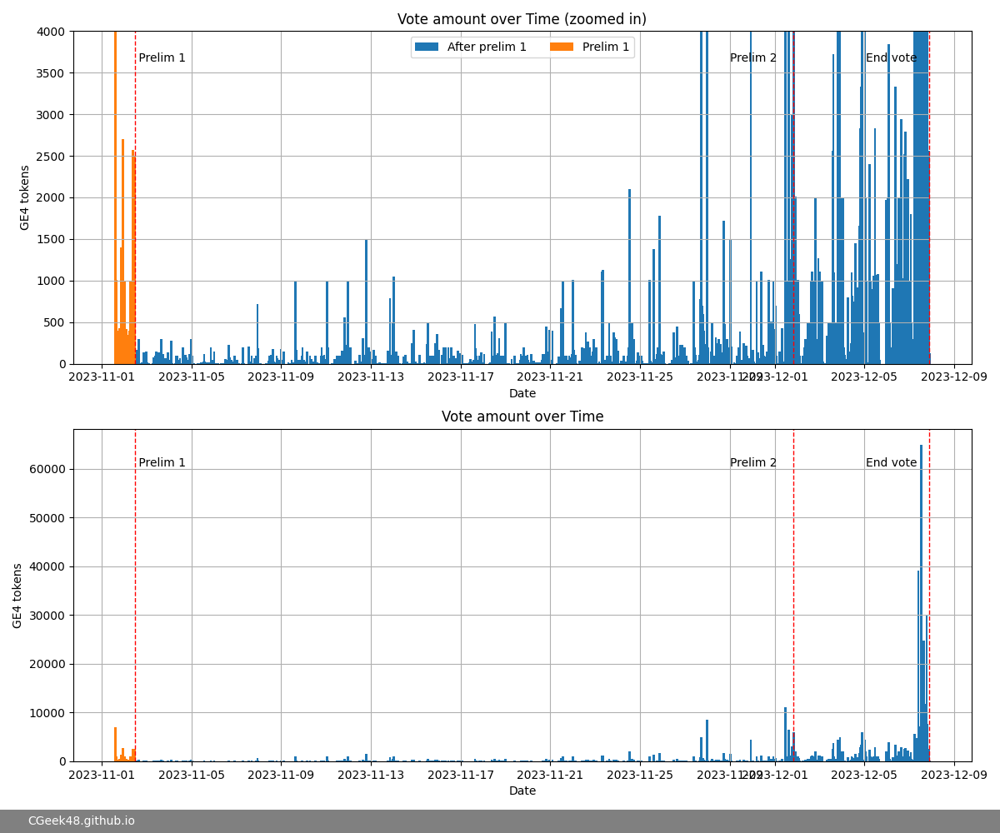
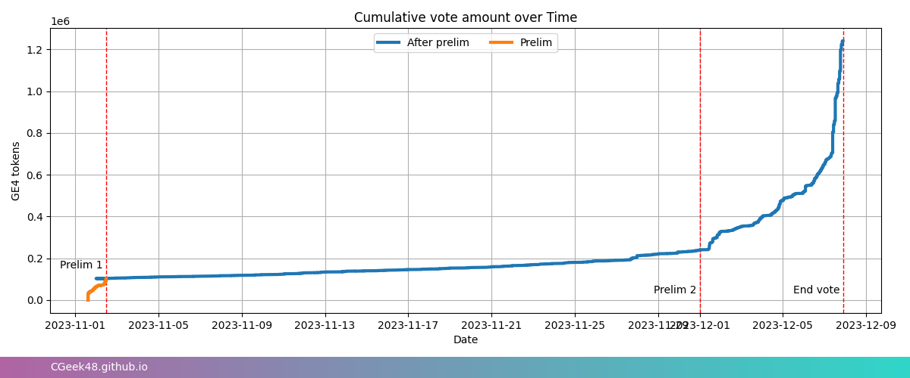
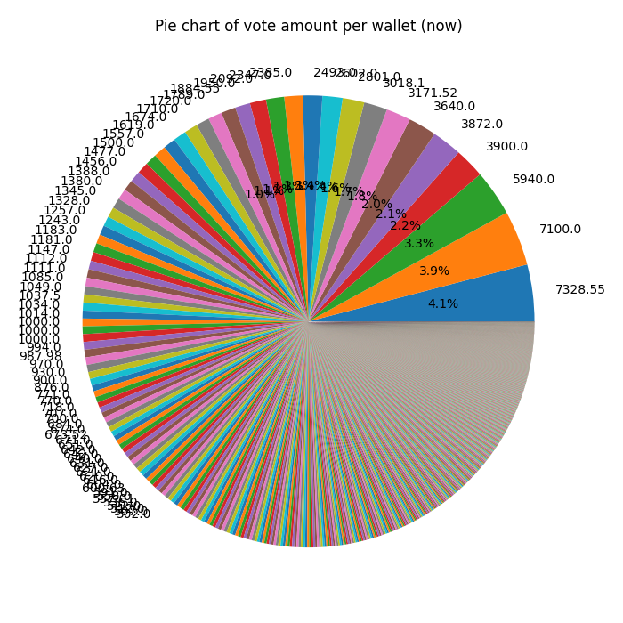
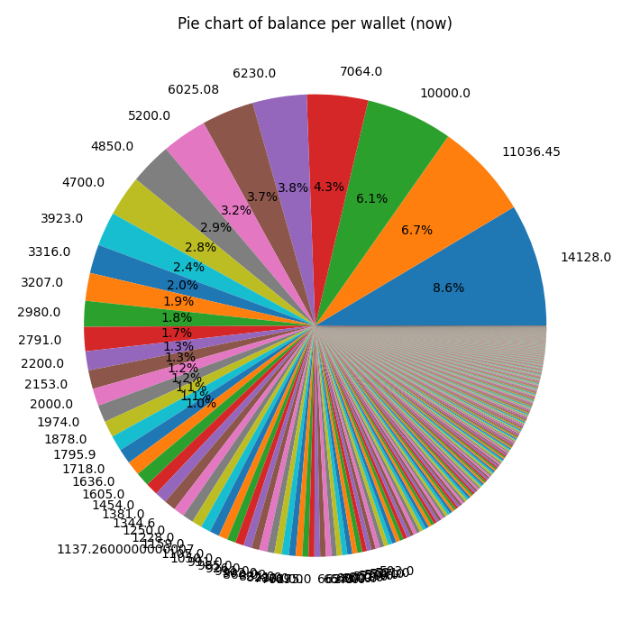
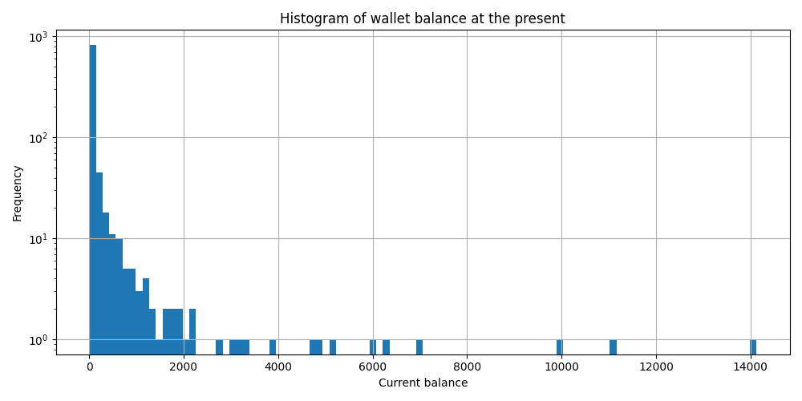

# BNK48 16th Single Senbutsu General Election 4

หรือที่เราเรียกกันสั้นๆว่า GE4 นั้นดำเนินมาถึงช่วงท้ายแล้ว (ณ วันที่ 25 พ.ย. 2566) เรามาดูข้อมูลต่างๆกันสักหน่อยดีกว่า ทั้งข้อมูลจากผลด่วนและข้อมูล ณ ปัจจุบัน

## ผลด่วน (ครั้งที่ 1)

ในผลด่วนครั้งที่ 1 ผลก็ออกมาดังภาพด้านบน ซึ่ง GE4 tokens ที่ใช้โหวตในผลด่วน (preliminary/prelim results) ถ้านับ 48 อันดับแรกตามจำนวนโหวตที่ อฟช ประกาศก็มีจำนวน 99950.829 tokens จาก 3562 wallets โดยมีจำนวนการโหลตสูงสุดที่ 7,000 tokens เราโชว์จำนวนการโหวตรวมของแต่ละ wallet ตาม pie chart ด้านล่าง จะเห็นจำนวนโหวตและเห็นว่านับเป็นกี่เปอร์เซ็นต์

ใน histogram นี้เราโชว์ histograms จำนวนโหวตของแต่ละ wallet ให้ดูว่ามีกี่ wallet ที่โหวตไปตามจำนวนในแกน x

แต่เมื่อเราจะคิดว่า... นี่มันแค่ผลด่วนหรอก แต่ละ wallet เค้าต้องมี tokens กั๊กอยู่อีกเท่าไหร่ นั่นแหละที่จะส่งผลต่อผล GE4 อย่างแท้จริง ...ใช่ครับ ณ ตอนนั้น บาง wallets ก็เก็บ tokens ไว้หลักพัน หรือหลักหมื่นแล้ว แต่ปัจจุบันสถานการณ์จะเป็นยังไง ไปดูกันต่อครับ

# สถานการณ์ปัจจุบันของ GE4

ณ วันที่เขียน เช้าวันที่ 25 พ.ย. 2566 เราก็มีการโหวตไปแล้วประมาณ 180594.71 tokens ซึ่งมันก็ตอบได้ยากว่ามันจะไปจบตรงไหน ตอน GE3 มีการโหวตรวม 1,093,074.36 tokens (tokens ละ 83.33 บาท) แต่หลังจาก BNK48 รุ่น 1 จบการศึกษาไปแล้ว มันก็ตอบได้ยากว่าแฟนคลับจะยังสู้กันดุเดือดแค่ไหน

และนี่คือจำนวนการโหวตของแต่ละ wallet ณ ปัจจุบัน

เราไม่สามารถทราบได้ว่าแต่ละ wallet จะโหวตใคร แต่สิ่งที่เราทราบได้ก็คือ เขายังมี tokens เก็บไว้จำนวนเท่าไหร่ ซึ่งจากการประมาณของเรา ก็ยังมี tokens ที่ยังไม่ได้ใช้โหวตอยู่อีก 165020.62 tokens เขาจะนำไปโหวตใคร ก็มาติดตามไปด้วยกันครับ

