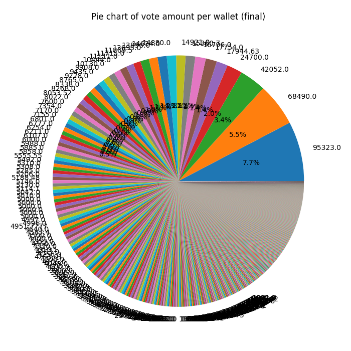

# BNK48 16th Single Senbutsu General Election 4

หรือที่เราเรียกกันสั้นๆว่า GE4 นั้นดำเนินมาถึงช่วงท้ายแล้ว (ณ วันที่ 25 พ.ย. 2566) เรามาดูข้อมูลต่างๆกันสักหน่อยดีกว่า ทั้งข้อมูลจากผลด่วนและข้อมูล ณ ปัจจุบัน

## ผลด่วน (ครั้งที่ 1)

ใน[ผลด่วนครั้งที่ 1](https://www.facebook.com/photo.php?fbid=920875399397107&set=pb.100044239668761.-2207520000&type=3) ผลก็ออกมาดังภาพด้านบน ซึ่ง GE4 tokens ที่ใช้โหวตในผลด่วน (preliminary/prelim results) ถ้านับ 48 อันดับแรกตามจำนวนโหวตที่ อฟช ประกาศก็มีจำนวน 99950.829 tokens จาก 3562 wallets โดยมีจำนวนการโหลตสูงสุดที่ 7,000 tokens เราโชว์จำนวนการโหวตรวมของแต่ละ wallet ตาม pie chart ด้านล่าง จะเห็นจำนวนโหวตและเห็นว่านับเป็นกี่เปอร์เซ็นต์

ใน histogram นี้เราโชว์ histograms จำนวนโหวตของแต่ละ wallet ให้ดูว่ามีกี่ wallet ที่โหวตไปตามจำนวนในแกน x

แต่เมื่อเราจะคิดว่า... นี่มันแค่ผลด่วนหรอก แต่ละ wallet เค้าต้องมี tokens กั๊กอยู่อีกเท่าไหร่ นั่นแหละที่จะส่งผลต่อผล GE4 อย่างแท้จริง ...ใช่ครับ ณ ตอนนั้น บาง wallets ก็เก็บ tokens ไว้หลักพัน หรือหลักหมื่นแล้ว แต่ปัจจุบันสถานการณ์จะเป็นยังไง ไปดูกันต่อครับ

# ผลด่วนครั้งที่ 2

วันที่ 1 ธ.ค. 2566 ก็มีการประกาศ[ผลด่วนครั้งที่ 2](https://www.facebook.com/photo/?fbid=920875399397107&set=a.331457648338888) ซึ่งก็ประกาศอย่างเซอไพรส์เมมเบอร์ 

# ก่อนจะประกาศผล...

ตอน GE3 มีการโหวตรวม 1,093,074.36 tokens tokens ละ 83.33 บาท รวมเป็น 91,085,886.41 บาท ส่วน GE4 มีการโหวตไป  1,239,678.836 tokens tokens ละ 68 บาท รวมเป็น 84,298,160.85 บาท (โดยประมาณ) ซึ่งถึงจะน้อยกว่า GE3 ที่ยังมี BNK48 รุ่นที่ 1 อยู่ไปประมาณ 6.788 ล้านบาท แต่ 84 ล้านบาทในช่วงเวลาที่แฟนคลับหายไปจำนวนมากก็ถือว่าแฟนคลับที่ยังอยู่ก็ยังเหนียวแน่นมากๆ

และนี่คือจำนวนการโหวตของแต่ละ wallet หลังจากปิดโหวตไปแล้ว ซึ่งใครโหวตใคร เมื่อ อฟช ปล่อยข้อมูลการโหวตออกมาแล้ว เราก็น่าจะรู้กัน

