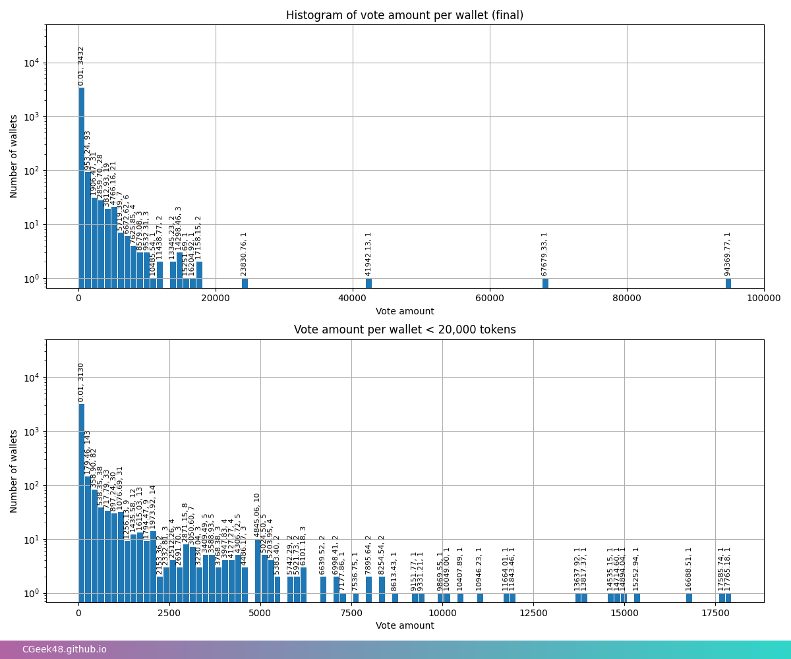

# BNK48 16th Single Senbutsu General Election 4

หรือที่เราเรียกกันสั้นๆว่า GE4 นั้นช่วงโหวตจบลงแล้ว เรามาดูข้อมูลต่างๆกันสักหน่อยดีกว่า ทั้งข้อมูลจากผลด่วนและข้อมูลหลังปิดโหวต

## ผลด่วน (ครั้งที่ 1)

ใน[ผลด่วนครั้งที่ 1](https://www.facebook.com/photo.php?fbid=920875399397107&set=pb.100044239668761.-2207520000&type=3) ผลก็ออกมาดังภาพด้านบน ซึ่ง GE4 tokens ที่ใช้โหวตในผลด่วน (preliminary/prelim results) ถ้านับ 48 อันดับแรกตามจำนวนโหวตที่ อฟช ประกาศก็มีจำนวน 99950.829 tokens จาก 3562 wallets โดยมีจำนวนการโหลตสูงสุดที่ 7,000 tokens 

ใน histogram นี้เราโชว์ histograms จำนวนโหวตของแต่ละ wallet ให้ดูว่ามีกี่ wallet ที่โหวตไปตามจำนวนในแกน x

## ผลด่วนครั้งที่ 2

วันที่ 1 ธ.ค. 2566 ก็มีการประกาศ[ผลด่วนครั้งที่ 2](https://www.facebook.com/photo/?fbid=920875399397107&set=a.331457648338888) ซึ่งก็ประกาศอย่างเซอไพรส์เมมเบอร์ 

# ผลอย่างเป็นทางการ

ผลอย่างเป็นทางการก็ประกาศไปแล้ว ([senbutsu](https://www.facebook.com/bnk48official/posts/pfbid02KKzUqhWL2v1zmakfkCDnZzjUAKQe5WERVL3AMsfdEzo9WCvcmkySKNCCmbZ6MFxpl), [under girls](https://www.facebook.com/bnk48official/posts/pfbid022zvSbQ5s3uw7B3XuRJoKVYRyznNEpXLac8hfHTh8ZLSY7jq52iEYWMWC2zJoucL5l), [next girls](https://www.facebook.com/bnk48official/posts/pfbid029Ys5NUonr9KdHhSJGM27MFkKXFZakkpdwb6ajM7j2tKjMXwVst7jYuDU2bNT7BE1l))
ตอน GE3 มีการโหวตรวม 1,093,074.36 tokens tokens ละ 83.33 บาท รวมเป็น 91,085,886.41 บาท ส่วน GE4 มีการโหวตไป 1,239,678.836 tokens tokens ละ 68 บาท รวมเป็น 84,298,160.85 บาท (โดยประมาณ) ซึ่งถึงจะน้อยกว่า GE3 ประมาณ 6.788 ล้านบาท

# คะแนนโหวตตามเวลา
ส่วนนี้โชว์คะแนนโหวตสะสมที่คำนวณทุกๆ 6 ชั่วโมง (คำนวณถี่กว่านี้จะดูยากกว่า)

## คะแนนโหวตในแต่ละช่วงเวลา
จะมาในเร็วๆนี้

## คะแนนโหวตสะสม
Histogram นี้แสดงให้เห็นว่ามีการโหวตปริมาณเท่าไหร่ ในเวลาใด

### รวม

### Kami 7

### อันดับ 7-16

### Under girls

### Next girls

### อันดับ 49-64

# การเปลี่ยนแปลงอันดับตามเวลา
## Kami 7

## Senbutsu 7-16

## Under girls

## Next girls

## อันดับ 49-64

## รวม

# จำนวนโทเค่นที่แต่ละกระเป๋าโหวต

# จำนวนโทเค่นที่ Top Spender ของแต่ละเมมเบอร์โหวตไป
[ประกาศผล](https://www.facebook.com/BNKToken/posts/355770307036401)

# จำนวนเมมเบอร์ที่แต่กระเป๋าโหวต
ในส่วนนี้จะนำเสนอว่าแฟนคลับที่โหวตในเมมเบอร์ A เป็นอันดับ 1 นั้น ได้โหวตเมมเบอร์คนอื่นหรือไม่ เป็นจำนวนกี่เปอร์เซ็นต์ ในส่วนนี้จะบอกได้ว่า แต่ละด้อมมี loyalty มากแค่ไหน หรือว่ามีการโหวตเมมเบอร์ที่อาจจะเป็นเพื่อนกับเมมเบอร์หลักของเรามากแค่ไหน ใครบ้าง (โชว์ histograms)

# โหวตเล็ก - โหวตใหญ่
ในส่วนนี้จะโชว์ว่าแฟนคลับแต่ละเมมเบอร์เน้นโหวตใหญ่ๆ หรือเน้นโหวตเล็กๆ
## คนโหวตหลายครั้ง เค้าโหวตใคร?

## คนโหวดใหญ่ เค้าโหวตใคร?

